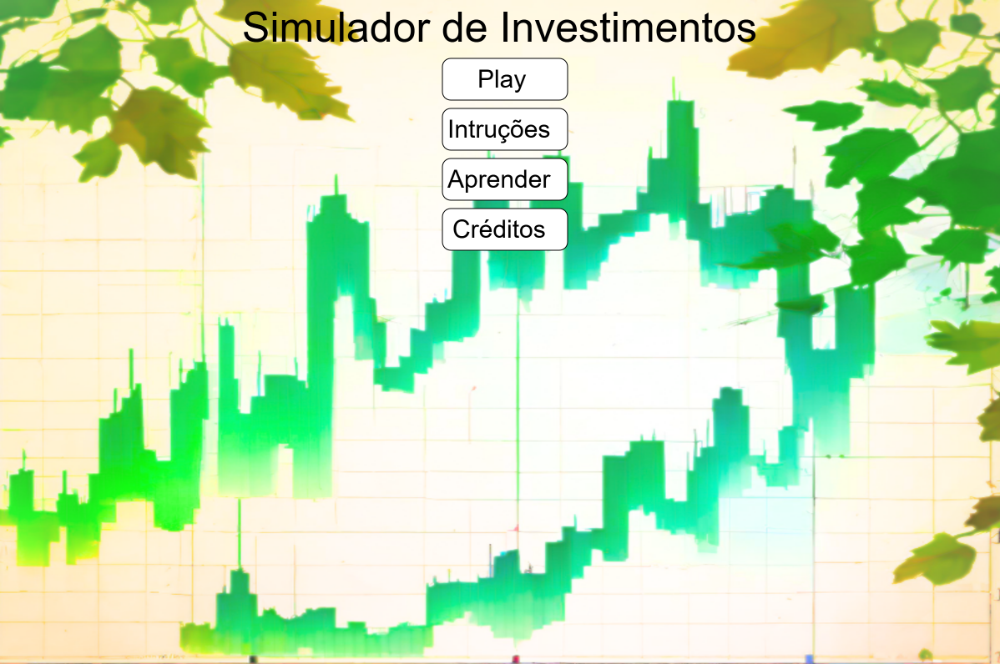
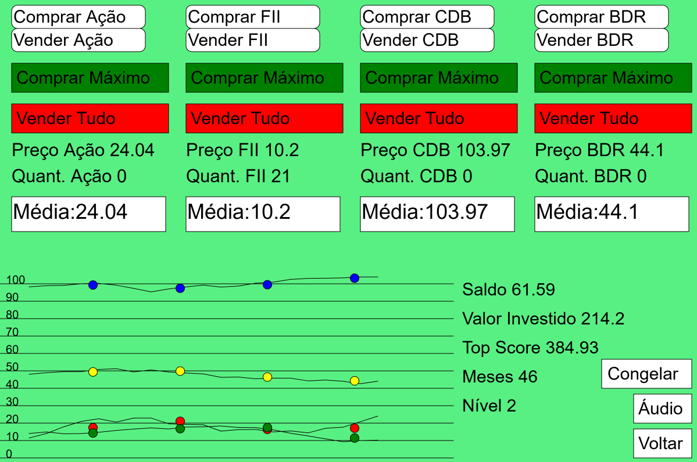

# 💰 Simulador de Investimentos

Um jogo/simulador interativo desenvolvido com **JavaScript** e **p5.js** com o objetivo de ensinar conceitos de educação financeira e investimentos de forma lúdica. 
O jogador começa com **R$100** e deve investir em diferentes tipos de ativos, buscando atingir o objetivo de **R$5000** investidos.

## 🛠️ Tecnologias Utilizadas
  - HTML5
  - CSS3
  - JavaScript
  - p5.js
  - p5.sound

## 🎮 Demonstração do Projeto

O jogo possui:
  - Menu principal
  - Tela de jogo interativa
  - Tela de instruções (BNCC EF09MA22)
  - Tela educativa sobre ativos
  - Tela de créditos

<h2 align="center">Tela Inicial</h2>

  

<h2 align="center">Tela com opções para comprar e vender</h2>

  

## 🗂️ Estrutura do Projeto

O projeto é composto pelos seguintes arquivos:

  - index.html --> Estrutura principal do simulador
  - style.css --> Estilização da página
  - sketch.js --> Lógica completa do jogo
  - p5.js --> Biblioteca gráfica
  - p5.sound.min.js --> Biblioteca de áudio
  - 📁 Assets --> Imagens e efeitos sonoros

## 📚 Conceitos Trabalhados
O projeto aborda:
  - 📈 Variação de preços
  - 📊 Gráficos de linha
  - 📉 Média de preços (média móvel simples a cada 5 valores)
  - 💵 Dividendos (FIIs)
  - 🏦 Tipos de ativos:
    - Ações
    - FIIs
    - CDB
    - BDR
  - 🎯 Progressão por níveis
  - 🔊 Efeitos sonoros
  - 🎓 Educação financeira aplicada à BNCC (EF09MA22)

## 🧠 Lógica do Jogo
💰 Sistema Financeiro
O jogador começa com R$100 de saldo. Pode comprar ou vender:
  - 1 unidade
  - Quantidade máxima possível
    
Os preços variam a cada clique para simulando os meses de investimento, FIIs pagam dividendos automaticamente e o valor investido é calculado em tempo real

## 📈 Sistema de Gráficos

O jogo exibe:
  - Gráfico de variação de preços (linhas)
  - Pontos representando médias calculadas a cada 5 atualizações
  - Escala proporcional no eixo Y

## 🏗️ Estrutura da Classe Principal

`class Ativo`
Cada ativo possui:
  - Nome, Preço, Quantidade, Dividend Yield, Controle de variação de preço, Lista de preços e Lista de médias
  - Métodos para Comprar, Vender, Comprar tudo, Vender tudo, Atualizar preço, Calcular média, Desenhar gráficos e Pagar dividendos

Isso permite reutilização de código e organização orientada a objetos.

## 🎯 Objetivo Educacional

Este projeto foi desenvolvido para ensinar matemática aplicada, trabalhar interpretação de gráficos, desenvolver pensamento financeiro e 
introduzir conceitos do mercado financeiro, além de tornar o aprendizado mais interativo.
